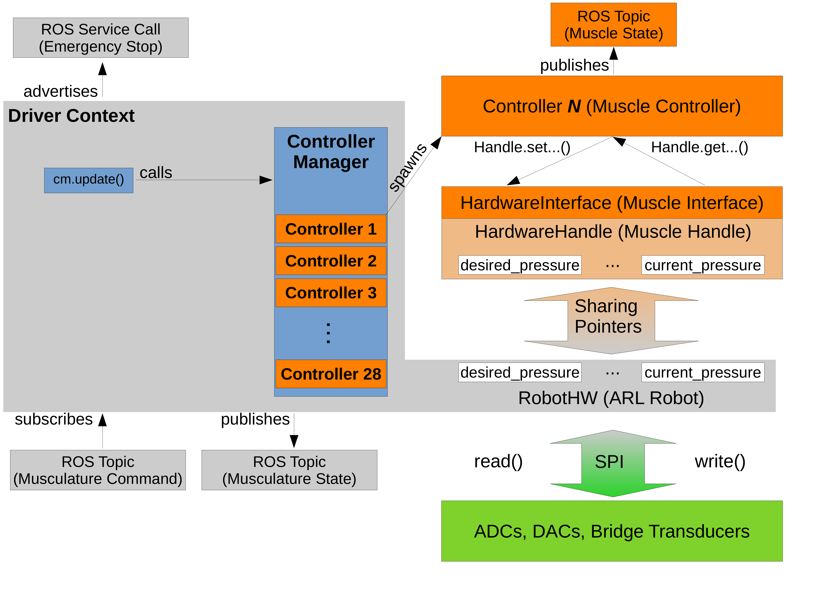

# ARL Upper Limb ROS Package

## Introduction
This meta-package contains the required packages to operate the ARL upper limb robot.

## Upper Limb Architecture


## Usage
To start the driver of the Robot and it's controllers the following launch files need to be executed.

```bash
roslaunch arl_hw arl_robot_driver.launch
roslaunch arl_controllers muscle_controller.launch
``` 